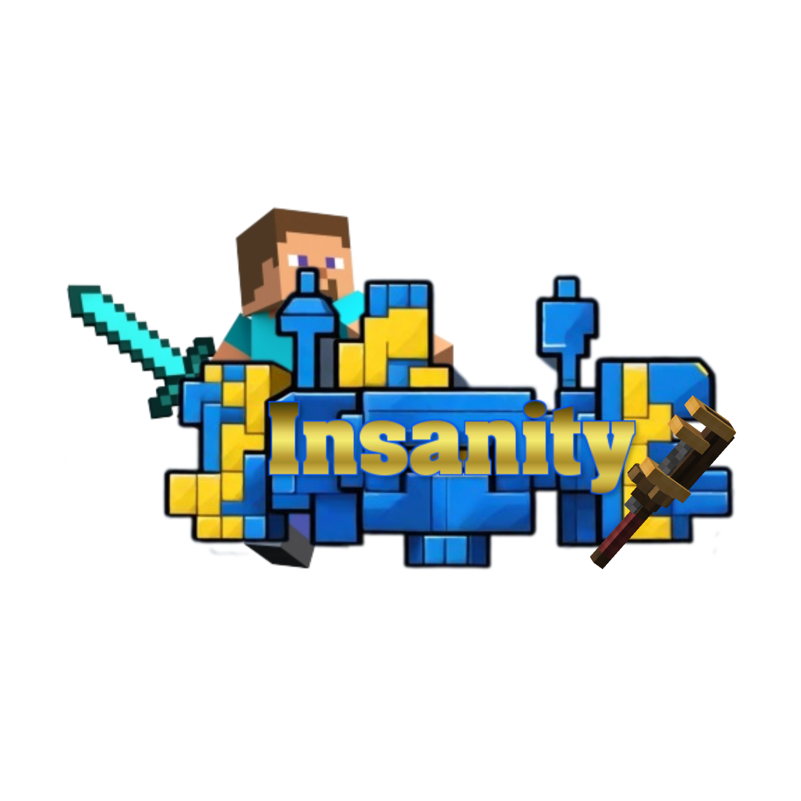

# Minecraft Insantiy 

## About
Modded SMP focussed on the Create mod

Minecraft Insanity war ein storybasierter SMP mit vielen Mods.

Es war eine Gemeinschaft aus Content-Creator, Zuschauern und Spielern.

Von der Create Mod über schöne Dekomods bis hin zu Backpacks oder einer [eigenen Mod nur für Insanity](https://modrinth.com/mod/insanity-project)  - auf Minecraft Insanity gab es viel zu entdecken.

Es gab zudem auch spielergeführte Unternehmen und einen Shopping-District. Die Währung wechselte zwischen Diamanten, Coins und Dienstleistungen.

Wir haben Social Media betrieben, dabei kamen ein Trailer und die Clips der Spieler heraus. Du kannst dir den Trailer auf [https://www.youtube.com/watch?v=FKeBV2JiwWI](https://www.youtube.com/watch?v=FKeBV2JiwWI) anschauen!

Es gab mehrere Staffeln mit verschiedenen Leuten, doch einige waren von Anfang an dabei. Zu Beginn mussten sie sich bewerben, später war der Server für alle offen.

---

## Info
- Mod "Insanity Project": [https://modrinth.com/mod/insanity-project](https://modrinth.com/mod/insanity-project)
- Linktree: [https://linktr.ee/Minecraft.Insanity](https://linktr.ee/Minecraft.Insanity)

Derzeit haben wir keine Pläne für eine erneute Staffel

Möglicherweise gibt es in der Zukunft ein Comeback. Wenn du darin interessiert bist, tritt unserem [Discord Server](https://discord.gg/hWaYcY75Bx) bei und verfolge den Ankündigungskanal.

---

## State
Mehrfach geendet, zuletzt am 6.2.2024

---

## Participate
Zurzeit nicht verfügbar. 
